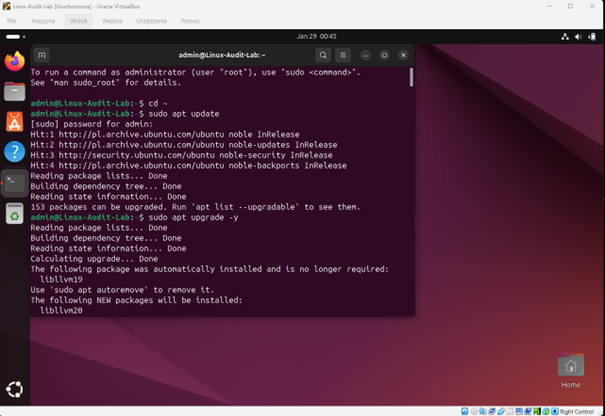
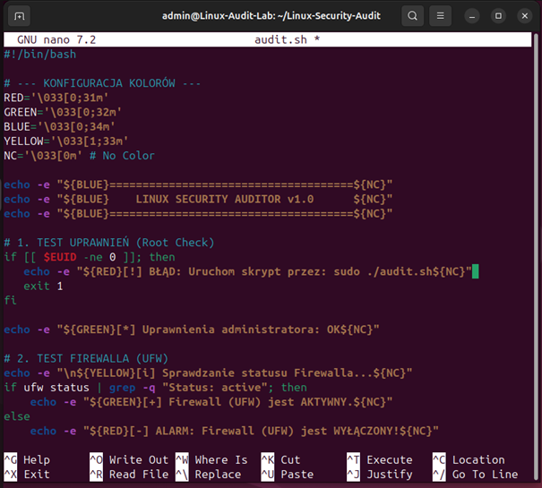
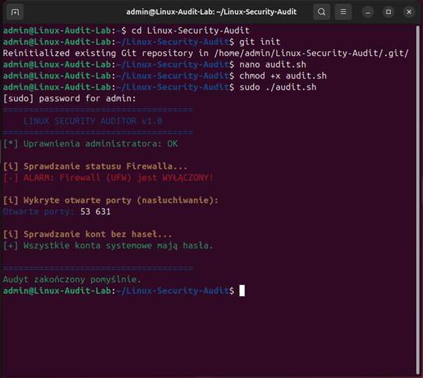
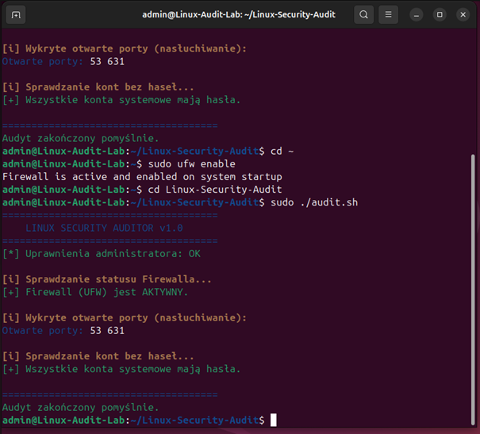

# Linux Security Auditor

## 🛡️ About the Project
A lightweight Bash script designed to automate baseline security audits on Debian/Ubuntu-based systems. This tool helps system administrators and security enthusiasts quickly identify common misconfigurations and potential security risks.

## 🚀 Key Features
- **Root Privilege Verification:** Ensures the audit is performed with necessary administrative access.
- **Firewall Status Audit:** Checks if the Uncomplicated Firewall (UFW) is active and protecting the system.
- **Network Exposure Analysis:** Lists all open ports and listening services to identify the system's attack surface.
- **Credential Integrity Scan:** Scans the `/etc/shadow` file to detect any user accounts without passwords.

## 🛠️ Environment Setup & Hardening
Before running the audit script, the system environment was prepared according to security best practices:
- **System Updates:** Performed full package update via `sudo apt update && sudo apt upgrade`.
- **Tooling:** Installed necessary utilities including `git`, `ufw`, and `iproute2`.
- **Testbed:** Developed and tested on **Ubuntu 22.04 LTS** running in a VirtualBox environment.

---

